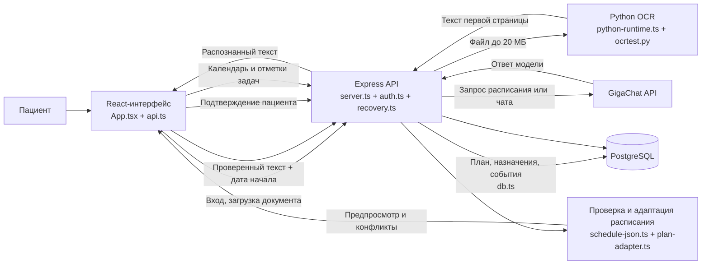

# Recovery — сопровождение пациента после выписки

**Recovery** — веб-приложение для сопровождения пациента после выписки. Пациент загружает рекомендации врача, проверяет распознанный текст и дату начала курса, а затем получает предварительный календарь задач, который можно проверить и сохранить. Сервис также включает чат с GigaChat, личный профиль и хранение плана с отметками выполнения в PostgreSQL.

**Статус:** MVP для локального запуска и проверки продуктовых сценариев. AI помогает структурировать информацию, но не заменяет врача: назначения нужно сверять с исходным документом и согласовывать с медицинским специалистом.

## Содержание

- [1. Общая концепция](#1-общая-концепция)
- [2. Архитектура и путь пользователя](#2-архитектура-и-путь-пользователя)
- [3. Навигация по репозиторию](#3-навигация-по-репозиторию)
- [4. Инструкция по запуску](#4-инструкция-по-запуску)
- [Хранение данных](#хранение-данных-и-правила-обновления-плана)
- [API](#api)
- [Проверки и тесты](#проверки-и-тесты)
- [Сборка и размещение](#сборка-и-размещение)
- [Если что-то не работает](#если-что-то-не-работает)

## 1. Общая концепция

Recovery помогает перенести подтверждённые пациентом рекомендации из выписки в календарь восстановления. OCR извлекает текст, GigaChat предлагает структуру расписания, а пациент проверяет распознанные данные и предварительный план до сохранения. После этого план и выполнение задач доступны при повторном входе.

## 2. Архитектура и путь пользователя



Путь пациента:

1. Регистрируется или входит в аккаунт.
2. Загружает PDF или изображение выписки; backend передаёт его локальному Python OCR-процессу.
3. Проверяет и при необходимости исправляет распознанный текст, указывает дату начала курса.
4. Получает предварительное расписание от GigaChat и просматривает назначения, даты и возможные конфликты.
5. Явно подтверждает план; backend проверяет решения и сохраняет их транзакционно в PostgreSQL.
6. Возвращается к календарю, отмечает выполненные задачи или добавляет личную задачу; может задать вопрос в чате.

В разработке Vite на порту 5173 проксирует `/api` на Express на порту 3000. При production-запуске Express раздаёт собранный frontend из `dist/`. OCR обрабатывает только первую страницу документа; черновик распознавания временный и хранится в памяти backend. Гостевой чат не отправляет запросы модели, а ответы GigaChat не являются медицинским заключением.

| Компонент | Ответственность |
| --- | --- |
| React + TypeScript, Vite | Интерфейс регистрации, чата, загрузки документа, календаря и профиля |
| Express / Node.js | API, сессии, вызов OCR и GigaChat, проверка и сохранение плана |
| Python / PyMuPDF / RapidOCR / ONNX | Извлечение текста из PDF и изображений |
| GigaChat API | Ответы чата и формирование черновика расписания |
| PostgreSQL | Аккаунты, сессии, подтверждённые планы, назначения и события |

## 3. Навигация по репозиторию

```text
KolobokMedGroup/
├── UI/
│   ├── src/
│   │   ├── App.tsx                  # Основной интерфейс: чат, аккаунт, документ, календарь и профиль
│   │   ├── api.ts                   # API-клиент, типы ответов, тайм-ауты и локальная дата пациента
│   │   ├── main.tsx                 # Точка входа React
│   │   ├── index.css                # Глобальные стили и адаптивная вёрстка
│   │   └── assets/images/           # Изображения профиля и фона
│   ├── index.html                   # HTML-шаблон frontend
│   ├── vite.config.ts               # Vite frontend, порт разработки и proxy /api
│   ├── package.json                # Скрипты и зависимости UI
│   └── README.md                    # Краткая инструкция по frontend
├── db/
│   └── migrations/
│       ├── 001_initial_schema.sql   # Начальные таблицы и ограничения БД
│       ├── 002_confirmed_instructions.sql # Подтверждённый текст рекомендаций
│       └── 003_patient_plan.sql     # Структура хранения плана пациента
├── scripts/
│   └── migrate.ts                   # Проверка и применение миграций 002 и 003
├── tests/
│   ├── persistence.test.ts          # API и сценарии сохранения плана
│   ├── patient-plan-migration.ts    # Проверки миграции и переноса данных
│   └── run-postgres.py              # Изолированный тестовый PostgreSQL и запуск тестов
├── server.ts                        # Express API, GigaChat, проверка расписания, запуск OCR
├── auth.ts                          # Регистрация, валидация, пароли, сессии и Origin
├── recovery.ts                      # Черновики, предпросмотр, план пациента и задачи
├── db.ts                            # PostgreSQL pool, транзакции и проверка миграций
├── plan-adapter.ts                  # Нормализация назначений, событий и конфликтов
├── schedule-json.ts                 # Извлечение JSON-структуры из ответа модели
├── python-runtime.ts                # Поиск Python-интерпретатора и запуск процесса OCR
├── ocrtest.py                       # Распознавание первой страницы документа
├── requirements.txt                 # Python-зависимости OCR
├── package.json                     # Скрипты backend, тестов и npm workspace UI
├── package-lock.json                # Общий lockfile npm для корня и UI
├── tsconfig.json                    # Конфигурация TypeScript backend
├── vite.config.ts                   # Сборка UI в корневой каталог dist/
├── .env.example                     # Шаблон конфигурации backend и PostgreSQL
└── README.md                        # Основная документация проекта
```

Основной backend-поток проходит через `server.ts`: он подключает роутеры авторизации и восстановления, вызывает GigaChat и Python OCR, а в production раздаёт frontend. `recovery.ts` управляет временными черновиками и атомарным сохранением; `plan-adapter.ts` нормализует события и сопоставляет назначения; `db.ts` предоставляет общие операции с PostgreSQL. Frontend входит через `UI/src/main.tsx`, а его API-типы и сетевые запросы сосредоточены в `UI/src/api.ts`.

## 4. Инструкция по запуску

Ниже сохранены подробные шаги для установки зависимостей, настройки Python и PostgreSQL, применения миграций и запуска обоих процессов. Все команды выполняются из корня репозитория, если явно не указан другой каталог.

### Что нужно скачать

| Что | Для чего | Где взять |
| --- | --- | --- |
| Node.js **24 LTS** с npm | Backend, frontend и сборка | [Официальная загрузка Node.js](https://nodejs.org/en/download) |
| Python 3 | Распознавание выписок | [Официальная загрузка Python](https://www.python.org/downloads/) |
| PostgreSQL **14 или новее**, включая `psql` | Обязательная база приложения | [Официальные установщики PostgreSQL](https://www.postgresql.org/download/) |
| Git | Получение и обновление репозитория, если используете clone | [Загрузка Git](https://git-scm.com/downloads) |
| Доступ к GigaChat API | Реальные AI-ответы и генерация плана | [Документация GigaChat](https://developers.sber.ru/docs/ru/gigachat/guides/main) |

Для macOS можно использовать Postgres.app, для Windows — установщик PostgreSQL с официальной страницы, для Linux — пакет своего дистрибутива. В Windows при установке Python включите доступ через PATH либо используйте launcher `py`.

Vite в текущем lockfile требует Node.js `^20.19.0 || >=22.12.0`; для нового окружения используйте Node.js 24 LTS. Текущий локальный запуск выполнялся на Node.js 24.14.0 и Python 3.14.3. Совместимость OCR зависит также от доступности ONNX-пакетов для вашей системы; Python 3.12 — альтернативный вариант окружения при проблемах установки этих пакетов.

Отдельно скачивать React, Tailwind, Express или модели вручную не требуется: JS-библиотеки устанавливает `npm ci`, Python-библиотеки — `pip`, модели OCR скачиваются при первом распознавании. CUDA/GPU, Docker, FastAPI, Streamlit и ключ Gemini для текущего приложения не нужны. Интернет нужен для установки пакетов, первой загрузки OCR-моделей и обращений к GigaChat.

### Установка и первый запуск

Все команды ниже выполняются **из корня `KolobokMedGroup`**, если явно не указан другой каталог. Откройте полученный через Git или архив проект в терминале.

### 1. Установить npm-зависимости

```bash
node --version
npm --version
npm ci
```

`npm ci` устанавливает зависимости backend и `UI` по единому lockfile. Отдельный `npm install` внутри `UI` не нужен.

### 2. Подготовить Python для OCR

macOS/Linux:

```bash
python3 --version
python3 -m venv .venv
.venv/bin/python -m pip install -r requirements.txt
```

Windows, PowerShell:

```powershell
py -3 --version
py -3 -m venv .venv
.\.venv\Scripts\python.exe -m pip install -r requirements.txt
```

Активация окружения не обязательна: команды используют его интерпретатор напрямую. После создания укажите его **абсолютный путь** в `PYTHON_EXECUTABLE` в корневом `.env`.

### 3. Подготовить `.env`

Если `.env` уже существует, сохраните рабочие значения и дополните недостающие поля. Для новой установки создайте файл из [.env.example](.env.example), не перезаписывая существующий:

```bash
# Только если корневого .env ещё нет
cp .env.example .env
```

PowerShell:

```powershell
# Только если корневого .env ещё нет
Copy-Item .env.example .env
```

Минимальные локальные настройки:

```dotenv
PGHOST=localhost
PGPORT=5432
PGDATABASE=recovery_dev
PGUSER=recovery_app
PGPASSWORD=YOUR_LOCAL_DATABASE_PASSWORD
APP_ORIGINS=http://localhost:5173,http://localhost:3000
COOKIE_SECURE=false

# macOS/Linux: замените на путь к своему проекту
PYTHON_EXECUTABLE=/absolute/path/KolobokMedGroup/.venv/bin/python

# Для настоящих ответов и генерации расписания
GIGACHAT_CREDENTIALS=YOUR_GIGACHAT_AUTH_KEY
GIGACHAT_SCOPE=GIGACHAT_API_PERS
GIGACHAT_MODEL=GigaChat-Pro
```

Пример интерпретатора Windows: `PYTHON_EXECUTABLE="C:/Projects/KolobokMedGroup/.venv/Scripts/python.exe"`. Пароль PostgreSQL должен соответствовать роли, которую создадите далее. Значения `CHANGE_ME` и `YOUR_...` необходимо заменить своими; реальные секреты в README не публикуются.

### 4. Создать роль и базу PostgreSQL

Запустите PostgreSQL. Откройте `psql` под локальным администратором PostgreSQL. Его имя зависит от установки: часто это `postgres`, а в Postgres.app — имя пользователя macOS.

```bash
# Замените ADMIN_USER на своего администратора PostgreSQL
psql -h localhost -p 5432 -U ADMIN_USER -d postgres
```

В открывшейся консоли `psql` выполните:

```sql
CREATE ROLE recovery_app LOGIN;
\password recovery_app
CREATE DATABASE recovery_dev OWNER recovery_app;
\q
```

Команда `\password` предложит ввести пароль, который нужно также указать в `PGPASSWORD`. Если роль и база уже существуют, используйте их — повторно создавать или удалять базу не нужно. База приложения должна принадлежать роли, выполняющей миграции.

Если `psql` не найден, добавьте каталог `bin` PostgreSQL в PATH или вызывайте программу по полному пути. Для Postgres.app это обычно `/Applications/Postgres.app/Contents/Versions/latest/bin/psql`; в PowerShell запуск пути с пробелами выполняется через `& "полный путь к psql.exe"`.

### 5. Применить миграции

Для **новой базы** сначала примените начальную схему. `psql` сам не читает `.env`: передайте параметры явно и введите пароль при запросе.

```bash
psql -h localhost -p 5432 -U recovery_app -d recovery_dev -v ON_ERROR_STOP=1 -f db/migrations/001_initial_schema.sql
node --import tsx scripts/migrate.ts
```

Если выбраны другие `PGHOST`, `PGPORT`, `PGUSER` или `PGDATABASE`, замените соответствующие аргументы первой команды. Вторая команда читает корневой `.env` и применяет недостающие `002_confirmed_instructions` и `003_patient_plan`. Она **не создаёт базу и не применяет 001**.

Для существующей базы с применённой 001 достаточно:

```bash
node --import tsx scripts/migrate.ts
```

Backend проверяет наличие всех трёх миграций до открытия HTTP-порта. Применённые SQL-файлы не редактируют: изменения схемы оформляются следующей номерной миграцией. Миграция 003 останавливается при неоднозначных прежних данных вместо их автоматического удаления или слияния.

### 6. Запустить backend и frontend

Оставьте открытыми **два терминала**.

Терминал 1, корень проекта:

```bash
npm run dev:backend
```

Ожидаемый вывод: `Server running on http://localhost:3000`.

Терминал 2, также корень проекта:

```bash
npm --workspace UI run dev:frontend
```

Альтернативно: перейдите в `UI` и выполните `npm run dev:frontend`. Откройте **[http://localhost:5173](http://localhost:5173)**. Frontend использует фиксированный порт 5173 и проксирует `/api` на порт 3000. Единой команды, запускающей оба процесса, пока нет.

Остановка каждого процесса — `Ctrl+C` в его терминале. После изменения `.env` перезапустите backend: горячий перезапуск этой командой не настроен.

### 7. Проверить установку

```bash
curl http://localhost:3000/api/auth/me
```

Без cookie ожидается `{"patient":null}`. Эта проверка подтверждает доступность API; права на базу проверяются при старте backend и при регистрации. В PowerShell вместо `curl` можно использовать:

```powershell
Invoke-RestMethod http://localhost:3000/api/auth/me
```

Затем зарегистрируйте тестовый аккаунт через интерфейс, отправьте вопрос и загрузите тестовый документ. Для реального расписания необходимы работающие GigaChat-настройки. При первом OCR дождитесь загрузки моделей; для проверки используйте документ без реальных персональных данных.

### Настройки окружения

| Переменная | Назначение |
| --- | --- |
| `PGHOST`, `PGPORT`, `PGDATABASE`, `PGUSER`, `PGPASSWORD` | Обязательные параметры PostgreSQL; `PGPASSWORD=CHANGE_ME` не допускается |
| `APP_ORIGINS` | Разрешённые origins браузера через запятую, без завершающего `/` |
| `COOKIE_SECURE` | `false` для локального HTTP; `true` обязателен в production с HTTPS |
| `GIGACHAT_CREDENTIALS` | Готовый Authorization Key, Base64 от `Client ID:Client Secret` |
| `GIGACHAT_CLIENT_ID`, `GIGACHAT_CLIENT_SECRET` | Альтернатива готовому ключу; backend кодирует пару в Base64 |
| `GIGACHAT_SCOPE` | Scope доступа; по умолчанию `GIGACHAT_API_PERS`, должен соответствовать вашему аккаунту |
| `GIGACHAT_MODEL` | Предпочтительная модель; по умолчанию `GigaChat-Pro` |
| `PYTHON_EXECUTABLE` | Абсолютный путь к Python с установленными OCR-зависимостями |
| `NODE_ENV` | `production` включает раздачу собранного frontend через Express |
| `DISABLE_HMR` | `true` отключает HMR и наблюдение за файлами Vite; обычно не требуется |

Для подключения GigaChat откройте личный кабинет API по ссылкам в его документации, создайте или выберите API-проект и получите Authorization Key либо Client ID/Client Secret. Доступ к веб-чату GigaChat не заменяет учётные данные API. Укажите соответствующий типу аккаунта scope и доступную модель, затем перезапустите backend.

Выберите один способ передачи GigaChat-ключа. Готовый `GIGACHAT_CREDENTIALS` имеет приоритет над парой ID/Secret. Backend получает OAuth-токен и кеширует его; при неудаче обращения к выбранной модели пробует `GigaChat`.

Без GigaChat-ключа интерфейс и аккаунты работают при доступной базе, а чат возвращает сообщение о демо-режиме. Генератор содержит демонстрационные данные, но backend **запрещает сохранять демо-расписание** как персональный план.

`GEMINI_API_KEY` и `APP_URL` из шаблона окружения не используются текущим backend; заполнять их не нужно. Отдельная переменная коллекции утверждённых документов в текущей интеграции отсутствует.

Запросы, изменяющие состояние, проверяют `Origin`, включая вход и регистрацию. Для ручных POST/PATCH/DELETE-запросов передавайте, например, `Origin: http://localhost:5173`. Не заменяйте `localhost` на `127.0.0.1` в адресе браузера без добавления этого origin в настройки.

## Хранение данных и правила обновления плана

### Что сохраняется

| Сущность | Содержимое |
| --- | --- |
| `patients` | Имя, нормализованные контакты, хеш пароля, часовой пояс |
| `plans` | Один план на пациента, статус, версия, дата начала, данные операции, подтверждённый текст |
| `prescriptions` | Инструкции, диапазоны дат, доступные параметры курса, статус и ключ дедупликации |
| `plan_events` | События на конкретные даты, необязательное время, статус и время выполнения |
| `upload_records` | SHA-256 файла, состояние и номер попытки обработки, без оригинала документа |
| `sessions` | SHA-256 случайного токена, срок действия и отзыв сессии |
| `schema_migrations` | Применённые версии схемы |

Исходные байты файла, имя файла и отдельный необработанный OCR-текст в базу не записываются. После подтверждения текст рекомендаций сохраняется в плане. Для OCR создаётся временный файл, который удаляется после завершения или ошибки.

### Что временное

Черновики OCR/генерации хранятся в памяти backend до 30 минут и теряются при перезапуске. Просроченный черновик нужно создать повторной загрузкой. Переписка, аватар, текущий ввод и открытые меню хранятся в состоянии frontend. Сохранённые назначения и отметки задач от этого не зависят.

### Повторы и конфликты

Повторная загрузка уже сохранённого файла определяется по SHA-256 для конкретного пациента и возвращает существующий план. Полное совпадение нормализованного назначения с пересекающимися датами дополняет курс недостающими событиями. Одинаковое название само по себе не является ключом совпадения.

Неоднозначные изменения текста или диапазонов проходят подтверждение. При замене уже выполненные события сохраняются. Неизвестные структурированные параметры могут оставаться `NULL`; это не доказательство того, что модель правильно интерпретировала исходный документ. Результат всегда нужно проверять перед сохранением.

Версия плана защищает от сохранения устаревшего предпросмотра: при параллельном изменении backend возвращает 409 и требует повторной проверки. Это счётчик ревизии, а не полноценный архив всех версий.

### Сессии и границы защиты

Пароли хешируются Argon2id. Сессия действует 7 дней и хранится в HttpOnly cookie с `SameSite=Lax`; в базе находится только хеш токена. Пациент определяется сервером по сессии, а не по переданному браузером `patient_id`. Backend проверяет владельца плана, событий и черновиков.

Для проверок сессии frontend ждёт до 8 секунд, для обычных JSON-запросов — до 30 секунд, для чата — до 90 секунд, для OCR и генерации — до 180 секунд. Тайм-аут в браузере не гарантирует прекращения уже запущенной серверной обработки. Активный чат отменяется при сбросе; полная защита от поздних ответов всего OCR/AI-контура остаётся задачей развития.

## API

Базовый путь — `/api`. Кроме `/auth/*`, маршруты требуют действующую сессию. JSON-запросы используют `Content-Type: application/json`; OCR принимает бинарное тело.

| Метод | Путь | Назначение / тело |
| --- | --- | --- |
| POST | `/auth/register` | `{username,email?,phone?,password,timezone}` |
| POST | `/auth/login` | `{contact,password}` |
| POST | `/auth/logout` | Отзыв текущей сессии |
| GET | `/auth/me` | `{patient}` или `{patient:null}` |
| PATCH | `/patient` | Сохранение `{username}`; контакты пока не обновляются |
| GET | `/plan` | `{plan,prescriptions,events}` |
| GET | `/plan/events?from=YYYY-MM-DD&to=YYYY-MM-DD` | События диапазона; по умолчанию день в часовом поясе пациента |
| PATCH | `/events/:eventId` | `{completed:boolean}` |
| POST | `/plan/tasks` | Личная задача `{text,date}` |
| POST | `/ocr?extension=pdf` | Файл, `application/octet-stream`; `{draftId,text}` либо существующий план |
| DELETE | `/drafts/:draftId` | Отмена временного черновика |
| POST | `/generate-schedule` | `{draftId,confirmedText,startDate,model?}`; предпросмотр без сохранения |
| POST | `/plans/confirm` | `{draftId,version,decisions?}`; транзакционное сохранение |
| POST | `/chat` | `{messages:[{role,content}],model?}`; ответ `{reply}` |

Решения по конфликтам: `decisions = {[key]: "keep" | "separate" | "replace"}`. Основные ошибки: 400 — неверные поля, 401 — требуется вход, 403 — недопустимый origin, 409 — конфликт состояния или контактов, 410 — истёк черновик, 413 — слишком большой файл, 502 — сбой OCR/GigaChat, 503 — попытка сохранить демо-расписание.

## Проверки и тесты

Из корня проекта:

```bash
npm run typecheck:backend
npm run typecheck:frontend
npm run build
npm run test:persistence
```

`test:persistence` запускает Python-скрипт, который создаёт **отдельный временный кластер PostgreSQL** на свободном loopback-порту, применяет схему, запускает Node.js-тесты и затем останавливает и удаляет тестовый кластер. Рабочая `recovery_dev` не используется для тестовых пациентов.

Проверяются конфигурация, нормализация и уникальность контактов, сессии, origins, владение данными, сохранение и повторная загрузка плана, отметки, повторные документы, конфликты, транзакции, параллельные сохранения, стабильность даты начала и отмена черновика. Основной набор использует подставные OCR/AI-функции и не требует реальных GigaChat-запросов.

По умолчанию PostgreSQL-инструменты ищутся в Postgres.app. Для другой установки укажите каталог, содержащий `initdb`, `pg_ctl` и `createdb`:

```bash
POSTGRES_BIN=/path/to/postgresql/bin npm run test:persistence
```

В Windows скрипт npm использует команду `python3`. Если у вас только `py`, запускайте Python-обёртку непосредственно:

```powershell
$env:POSTGRES_BIN="C:/Program Files/PostgreSQL/17/bin"
py -3 tests/run-postgres.py
```

Версия и путь PostgreSQL в примере заменяются на установленную у вас. Тестовый кластер следует запускать от обычного пользователя, которому доступно создание процессов и временных файлов.

### Опциональные проверки

Реальные OCR и GigaChat в изолированной тестовой базе:

```bash
# Python, которым запускается обёртка, должен иметь OCR-зависимости
RUN_LIVE_PIPELINE=1 .venv/bin/python tests/run-postgres.py
```

Это выполняет реальные обращения к API и требует действующих настроек GigaChat. В PowerShell задайте `$env:RUN_LIVE_PIPELINE="1"` и выполните `.\.venv\Scripts\python.exe tests/run-postgres.py`.

Браузерный тест включается через `TEST_PLAYWRIGHT_MODULE` — абсолютный путь к установленному `playwright/index.mjs`. Playwright и его Chromium не входят в зависимости приложения; установите их в отдельное тестовое окружение, если нужна эта проверка. Frontend должен работать на 5173. API-запросы тестового браузера перенаправляются в изолированную базу.

```bash
TEST_PLAYWRIGHT_MODULE=/absolute/path/node_modules/playwright/index.mjs npm run test:persistence
```

Без этих переменных браузерный и live-тест пропускаются. Успешная сборка или тесты с подставным AI не доказывают, что GigaChat доступен в конкретном окружении. Отдельные браузерные проверки профиля и защиты UI от зависших запросов проводились в ходе разработки; их временные скрипты не являются частью штатного тестового набора репозитория.

## Сборка и размещение

```bash
npm run build
```

Vite собирает `UI` в корневой `dist/`, включая фотографии профиля и фон. Рабочий API, Python и PostgreSQL всё равно нужны: это приложение с backend, а не полностью статический сайт.

Для раздачи сборки Express из корня:

```bash
NODE_ENV=production npm run start:backend
```

PowerShell:

```powershell
$env:NODE_ENV="production"
npm run start:backend
```

Перед запуском задайте `COOKIE_SECURE=true`, точный HTTPS-origin сайта в `APP_ORIGINS` и обеспечьте внешний HTTPS, например через reverse proxy. Сам Express слушает HTTP на порту 3000; TLS-терминация на публичном адресе настраивается отдельно. В production backend отказывается стартовать с `COOKIE_SECURE=false`.

На сервере установите Node.js, Python/OCR-зависимости, обеспечьте доступ к PostgreSQL, примените миграции и настройте управление процессом backend. Поскольку `start:backend` использует `tsx`, а сборка не компилирует backend отдельно, установка только npm production-зависимостей без `tsx` недостаточна. Dockerfile, CI/CD и готовые конфигурации reverse proxy в репозитории не предоставлены.

### Что требуется перед публичным пилотом

В текущем Git отслеживается корневой `.env`; это не шаблон безопасного распространения секретов. Перед публикацией проверьте историю и содержимое, организуйте хранение серверных секретов и при необходимости замените раскрытые ключи. В текущем GigaChat HTTPS-клиенте отключена проверка сертификата (`rejectUnauthorized: false`); для публичного окружения необходимо настроить доверенные сертификаты и вернуть проверку TLS.

Также предстоит определить правила доступа и обработки медицинских данных, резервного копирования, хранения и удаления данных, добавить контроль нагрузки и мониторинг. Текущие сессии и проверки владельца решают часть технических задач, но не означают готовность системы к промышленному медицинскому использованию.

## Если что-то не работает

| Симптом | Причина и действие |
| --- | --- |
| Frontend открылся, но регистрация/чат не работают | Проверьте второй процесс: `npm run dev:backend` должен работать из корня |
| «Проверяю сессию…» | Фоновая проверка ограничена 8 секундами; вход и регистрация доступны независимо от неё |
| «Сервер не ответил вовремя» | Запрос достиг тайм-аута; проверьте backend, базу и сеть, повторите операцию |
| «Нет соединения с сервером» или 502 от Vite | Backend не слушает порт 3000 либо недоступен |
| `Database configuration missing` | Заполните все `PG*` в корневом `.env`; `CHANGE_ME` не является рабочим паролем |
| `Cannot connect ... PostgreSQL ... schema` | Проверьте запуск PostgreSQL, пароль, права, имя базы и миграции |
| Требуются numbered migrations | Примените 001 для новой базы, затем `scripts/migrate.ts` |
| `Migration conflict` | В прежних данных неоднозначные связи; разберите их отдельно, не сбрасывайте базу |
| «Недопустимый источник запроса» | Адрес браузера должен точно совпадать с одним из `APP_ORIGINS` |
| `psql` / `initdb` не найден | Добавьте PostgreSQL `bin` в PATH; для тестов задайте `POSTGRES_BIN` |
| «Не удалось распознать документ» | Проверьте `PYTHON_EXECUTABLE`, зависимости и доступ к Hugging Face |
| OCR видит только часть PDF | Текущая реализация обрабатывает только страницу 1; остальные страницы пока не читаются |
| Первый OCR долго работает | Скачиваются модели; браузер ждёт до 180 секунд, при необходимости повторите после загрузки |
| `No matching distribution` при pip install | Проверьте версию Python и архитектуру, при необходимости создайте окружение Python 3.12 |
| Чат отвечает про демо-режим | Настройте GigaChat-ключ и перезапустите backend |
| «Не удалось получить ответ GigaChat» | Проверьте ключ, scope, доступную модель, лимиты аккаунта и сеть |
| «Демо-расписание не сохраняется» | Для персонального плана нужен действующий GigaChat API |
| «Черновик истёк» | Прошло 30 минут или backend перезапущен; загрузите документ заново |
| Изменения контактов недоступны | Текущие настройки сохраняют только имя; email и телефон пока для чтения |
| Аватар или переписка исчезли после reload | Это временные данные frontend; план и отметки должны сохраниться |
| Порт 5173/3000 занят | Остановите прежний экземпляр приложения или освободите порт |
| Production-вход не сохраняется | Проверьте внешний HTTPS, `COOKIE_SECURE=true` и разрешённый origin |
| `npm run preview` показывает UI без API | Vite preview не заменяет Express; используйте production-запуск backend для проверки полного приложения |
